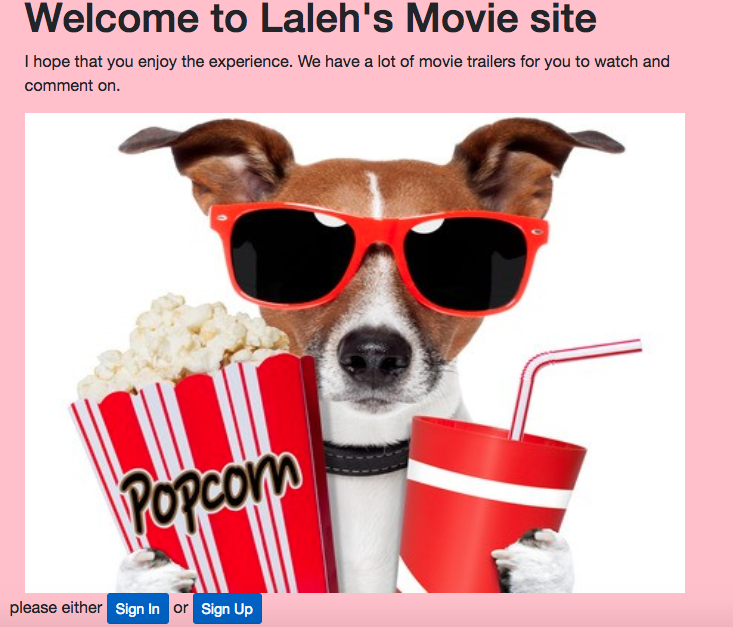
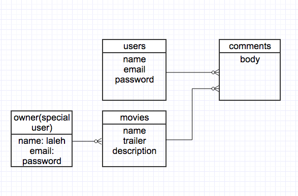

# Project 2- Movies App  
   

App provides users a welcome page with greeting and 2 options. If you are already a user you can choose the sign in button otherwise you need to create an account clicking the sign up button. Once you are inside the app you can see a list of diffrent movies.If you click on name of each movie you can have access to some details about that movie such as name, trailer, description. You also can write comments to the movie or read other users comments. Each user can delete his own comments. The owner of the website can add other movies to list delete them from the list and update them.

 
## App Logic
An App with 3 models and 6 controllers.
#### Wireframe-Diagram
  
    
     
               
       
             
       
           
             
    
           
####  Models
* Movies  
* Users  
* Comments    
  
#### ERD-Diagram  
        
  

####  Controllers
* Application  
* Welcome    
* Movies  
* Users  
* Comments  
* Sessions 

## Tools
* Trello board  
* Gliffy for ERD  
* Balsamiq for Wireframe 
* Visual Studio Code 
* Ruby on Rails  
* Bootstrap     
* Chrome Developer Console   
* MacDown  
 
 

 

## Resources
* Heroku  
* Writing Good User Stories  
* Presenting Information Architecture   

## Approach  

I started by drawing the models and their connections with each other on paper. Then I used the Trello App to create the Diagrams and structure of the App. Then I created the Wireframes and the ERD. 
Started the creation of the new App called movie-reviews.  
Activated the database.  
Generated models and controllers  
Creatied the visual studio code for the app  
and the html.erb files. Finally I added the Bootstrap to style the app.

## Installation/startup instructions
* Creating the new APP called movie-reviews  
* Setting the database to postgresql  
* Creation the database  
* Migration of database 
* Generation the 3 models  
* Generation the 6 controllers  
* Activation the rails server 
* Creation the route.rb  
* Defination of CRUD in controllers  
* Add the html.erb files in Ruby on Rails
* Install bundle in terminal to activate the bootstrap  
* Add the bootstrap to style the App 
  
  

    
## Future Enhancements

* Make the app more complex with more models  
* Add photo for each user  
* Add like or dislike button to each comment  
* Add rating to a movie  
* Change the style of the App  

## Acknowledgements  

#### Links  
* [Heroku](https://lalehs-movies-website.herokuapp.com/)  
* [Github](https://github.com/lalehnastar/Project2-Movie-reviews-App)  
* [Trello](https://trello.com/b/sb5FGqHo/laleh-nastar)

#### Images 
 * [Movie-Listing](https://encrypted-tbn0.gstatic.com/images?q=tbn:ANd9GcTh0yvtPjuPpeXoBFMcE_k5dTG6-YE96u8AX0b_H7srMoyt_O91XQ)
 * [Log In](http://villageoffaith.org/uploads/6/2/2/8/62282299/1370146_orig.png) 
 * [Index](https://images-na.ssl-images-amazon.com/images/I/61Teggpds4L._SL1024_.jpg)
 

 
