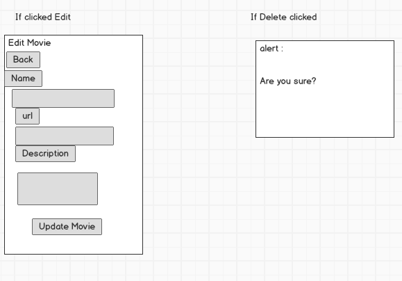

# Project 2- Movies App
--

[here](https://lalehs-movies-website.herokuapp.com/)

App provides users a welcome page with greeting and 2 options. If you are already a user you can choose the sign in button otherwise you need to create an account clicking the sign up button. Once you are inside the app you can see a list of diffrent movies. For each movie you have 2 options edit and delete. You can also add your own movie clicking on Add Movie button. If you click on Add Movie button the app provides you a new page to create a new movie with the movie name, url and description. If you click on name of each movie you will access some details about that movie such as name, trailer, description. You also can write comments to the movie or read other users comments. If you click on edit button for each movie you can edit the movie and save the changes to that movie and update that movie. Finally if you click on delete buton for each movie you can delete that movie from the list but before that you will see an alert asks you if you are sure before deleting the movie. Each user can delete his own comments. 

 
## App Logic
An App with 3 models and 6 controllers.
#### Wireframe-Diagram
  
          
        
      
           
####  Models
Movies  
Users  
Comments  
#### ERD-Diagram  
        
  

####  Controllers
Application  
Welcome    
Movies  
Users  
Comments  
Sessions 
  
Each user can log in and see the movies and their details such as names, description and trailer. The users can write their opinion about the films as comments. Each user can delete his comments but not the others comments. They also can create new movies with their details. If they are totally new to the app they need to create an account to have access to the movies.

## Tools
Ruby on Rails  
Bootstrap  
Postgres  
Chrome Developer Console  
Visual Studio Code  
MacDown  
Trello board  
Gliffy for ERD  
Balsamiq for Wireframe  
 

 

## Resources
Heroku (for hosting your back-end)  
Writing Good User Stories (for a few user story tips)  
Presenting Information Architecture (for more insight into wireframing)  

## Approach  

I started by drawing the models and their connections with each other on paper. Then I used the Trello App to create the Diagrams and structure of the App. Then I created the Wireframes and the ERD. 
Start the creation of the new App called movie-revies  
Activate the database  
Generation of models and controllers  
Creation of visual studio code for the app  
Using the bootstrap to style the app

## Installation/startup instructions
Creating the new APP called movie-reviews  
Setting the database to postgresql  
Creation the database  
Migration of database 
Generating the 3 models  
Generationing the 6 controller  
Activate the rails server  
Install bundle in terminal to activate the bootstrap  
Activate the route.rb  
Defination of CRUD in controllers  
Addion of html.erb files in Ruby on Rails  
Add the bootstrap to style the App  

  
  

    
## Future Enhancements

Make it more complex with more models  
Add photo for each user  
Add like or dislike to each comment  
Add rating to a movie  
Change the style of the App

 
